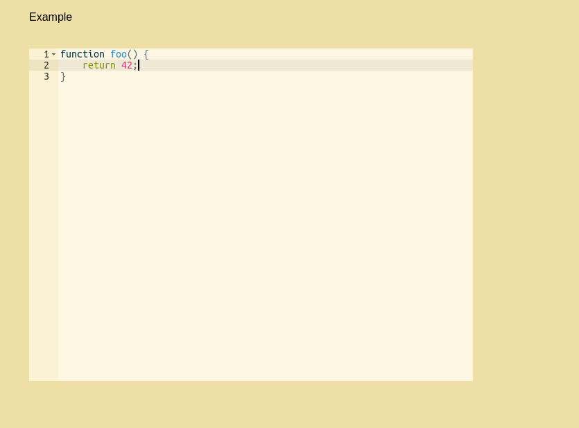
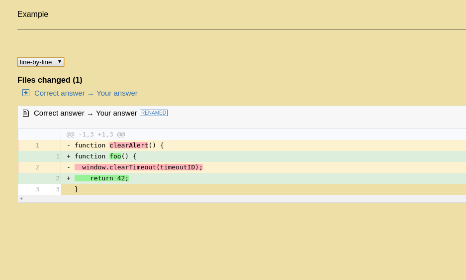

# Anki CodeDiffer

Add-on for Anki SRC. It allows you to create cards with interactive input. Also it uses differ to visualize how your input is different from correct answer.

## Examples

Question:




Answer:



## When/How to use?

This addon should be helpful to learn some new APIs. With it you can learn API not by drilling, but by trying to solve some simple tasks.

For example, you can copy/paste some code samples from [MDN](https://developer.mozilla.org/en-US/docs/Web/JavaScript/Reference/Global_Objects/Generator):


```
Q:

Create simple example of JS Generator, that return numbers `1, 2, 3`
[diff][/diff]

A:

[diff-answ]
function* gen() { 
  yield 1;
  yield 2;
  yield 3;
}
[/diff-answ]
```

Tags `[diff][/diff]` and `[diff-answ][/diff-answ]` should be added manually. 
It can be improved in the feature by adding some additional GUI into Anki card editor.

- `[diff][/diff]` is used to to let add-on figure where to insert code editor;
- `[diff-answ][/diff-answ]` is used to to let add-on figure which part of the answer should be used as "correct answer" in code differ.

## Supported languages and themes

```python
SUPPORTED_LANGUAGES = [
    'javascript',
    'python',
    'sql',
    'typescript'
]

SUPPORTED_THEMES = [
    'chrome',
    'monokai',
    'solarized_dark',
    'solarized_light'
]
```

## TODO

1. Allow to override sample's language by car'ds field `Lang`.
2. Add GUI to mark code editor place on the question side.
2. Add GUI to mark differ-ed part of answer.
4. Research how to add any of [Ace](https://ace.c9.io/)'s languages/themes on the fly.
